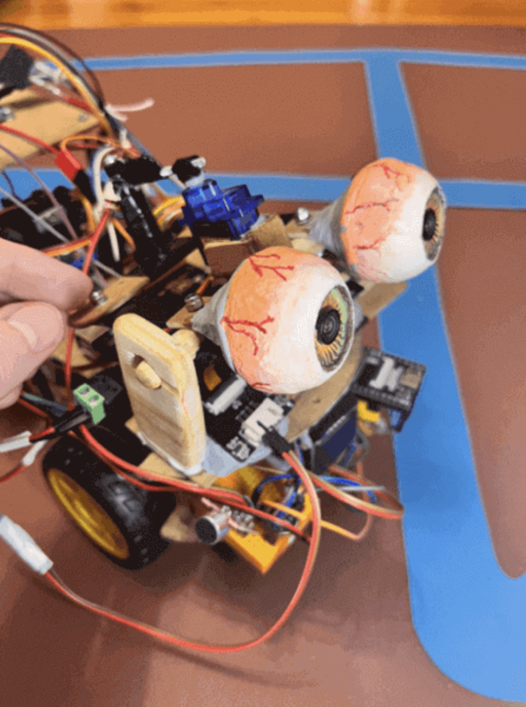
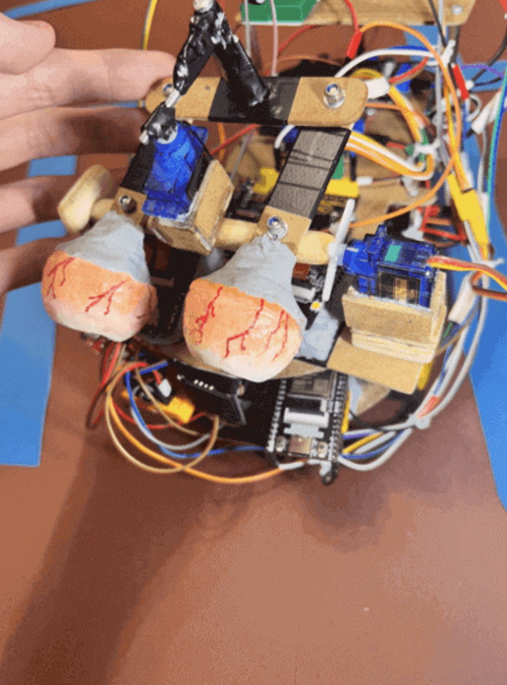

# LLM Arduino Robot

<div align="center">
  
  
</div>

## Demos

<div align="center">

| move_motors.ino (test sketch) | move_servos.ino (test sketch) | move_servos.ino (test sketch) | move_servos.ino (test sketch) |
|:---:|:---:|:---:|:---:|
| <video src="https://github.com/user-attachments/assets/57d3474f-c6d3-45ea-b89b-50ce2faa5383" width="250"><video/> | <video src="https://github.com/user-attachments/assets/ae52eb3b-29fb-4f1d-a0aa-84d0b2e7ebf1" width="250"><video/> | <video src="https://github.com/user-attachments/assets/ae52eb3b-29fb-4f1d-a0aa-84d0b2e7ebf1" width="250"><video/> | <video src="https://github.com/user-attachments/assets/ae52eb3b-29fb-4f1d-a0aa-84d0b2e7ebf1" width="250"><video/> |

</div>

## Description

[Missing description]

To run the project:

- `arduino/`: Arduino test and production sketches
- `esp32/`: ESP32 (-CAMs, -WROVER) test and production sketches
- `computer/`: Computer test and production scripts
- `requirements.txt`: Dependencies to install to run the robot

To help understand/use the project:

- `drawio/`: Drawio flowcharts to understand the inner workings of the robot
- `fritzing/`: Cable connections in Fritzing
- `guides/`: Step-by-step guides for the contruction of the robot
- `images/`: Images used in the guides
- `videos/`: Videos used in the guides
- `LICENSE`: Project license
- `README.md`: Overview of the project
- `.gitignore`: Files not pushed for being temporary, private, or unnecessary

To help improve the docs on the robot-building process:

- `tools/`: Shell scripts to compress videos, etc. before pushing to remote

## Technical Overview

### Robot Components

Vision:

- 2x ESP32-CAM (with OV2640 camera and async web server) to send each eye's frame to the computer (upon request)

Audio:

- Input: KY-037 sound sensor (adjustable by potentiometer) triggers INMP441 I2S microphone for RECORDING_DURATION_MS (e.g., 5000 ms) audio recording. ESP32-WROVER sends this to computer via web sockets. Recording progress -e.g. Listening (3s)...- visualized on OLED SSD1306 I2C 128x64 screen.

- Output: Speaker with MAX98357A amplifier for audio playback. Audio (from Coqui.ai's text-to-speech conversion) sent from computer, received by ESP32-WROVER, and forwarded to MAX98357A.

Mobility:

- ESP32-WROVER server receives commands
- Arduino Uno forwards commands to:

  - L298N motor driver (for wheel movement)
  - 2x SG-90 servos (for up/down/left/right eye movement)

### Computer Components

Visual Processing:

- YOLOv8 (You Only Look Once) to detect objects - potentially obstacles (if both frames are available)
- SGBM (Semi-Global Block Matching) to estimate object depth (if both frames are available)
- DeepFace to recognize interlocutor's face (if at least 1 frame is available)

Audio Processing:

- Web sockets receive audio from ESP32-WROVER
- Whisper for speech-to-text transcription, discarding if below MIN_WORDS_THRESHOLD

Memory:

- ChromaDB to retrieve relevant long-term memories before every LLM or LMM call

AI Processing:

- LMM (Large Multimodal Model) to describe the view in a context-relevant way
- LLM (Large Language Model) to decide what to speak and which parts to move

## Guides with Diagrams

- [Connections](guides/00_connections.md)
- [Components](guides/01_components.md)
- [Chassis and motors](guides/02_chassis_and_motors.md)

## Setup

### Computer

Clone (and cd into) the repository:

```
git clone https://github.com/Any-Winter-4079/Arduino-Robot.git
cd Arduino-Robot
```

Create a virtual environment:

```
python -m venv venv
```

Activate the virtual environment:

- Windows: `venv\Scripts\activate`
- macOS/Linux: `source venv/bin/activate`

Install the dependencies:

```
pip install -r requirements.txt
```

### Robot

Install the Arduino IDE

Install esp32 by espressif into Boards Manager

Add:

- https://github.com/me-no-dev/AsyncTCP
- https://github.com/me-no-dev/ESPAsyncWebServer

into `XXXX/Arduino/libraries` (e.g. `Users/you/Documents/Arduino/libraries/` on macOS) for an async web server to send the images to your computer (to go from 1 fps to 37 fps at (320x240) resolution)

#### ESP32

To allow your ESP32s to communicate with your computer in your local network, replace:

```
const char* ssid1 = "****";
const char* password1 = "****";
IPAddress staticIP1(*, *, *, *);
IPAddress gateway1(*, *, *, *);
```

with your primary network (e.g. your home Wi-Fi) details

Replace:

```
const char* ssid2 = "****";
const char* password2 = "****";
IPAddress staticIP2(*, *, *, *);
IPAddress gateway2(*, *, *, *);
```

with your secondary (backup) network (e.g. phone hotspot)

And in the case of the ESP32-WROVER, replace:

```
const char* websocket_server_host1 = "*.*.*.*";
```

with your computer IP, when connected to your primary network

And:

```
const char* websocket_server_host2 = "*.*.*.*";
```

with your computer IP, when connected to your backup network

> **Note:** Make sure to provide unique IPs to each ESP32 (e.g. `192.168.1.180` and `192.168.1.181` for your ESP32-CAMs and `192.168.1.182` for your ESP32-WROVER, with your computer at `192.168.1.174`).

Then, for each of your 2 cameras (e.g. AiThinker, M5Stack Wide) and WROVER (e.g. Freenove), flash (through their USB type C or VCC/GND/TX/RX) `esp32/XXXX/production.ino` (e.g. `esp32/m5stackwide/production.ino`) with the following `Tools` setup:

```
Board: "ESP32 Dev Module"
Port: "/dev/cu.usbserial-110" (select your own)
CPU Frequency: "240MHz (WiFi/BT)"
Core Debug Level: "None"
Erase All Flash Before Sketch Upload: "Disabled"
Events Run On: "Core 1"
Flash Frequency: "80MHz"
Flash Mode: "QIO"
Flash Size: "4MB (32Mb)"
JTAG Adapter: "Disabled"
Arduino Runs On: "Core 1"
Partition Scheme: "Huge APP (3MB No OTA/1MB SPIFFS)"
PSRAM: "Enabled"
Upload Speed: "115200"
```

#### Arduino Uno

Flash (through its USB type B) `arduino/production.ino` with the RX pin temporarily disconnected

## Usage

[Missing usage]

## License

[Missing license]
