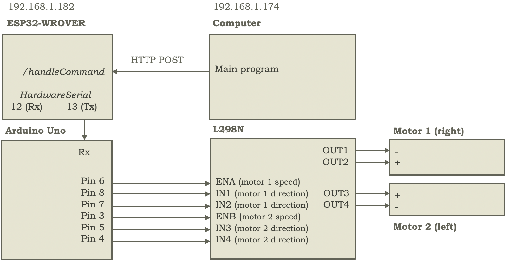

# LLM Arduino Robot

<div align="center">
    
</div>

## Demos

<div align="center">

|                               Detect sound + send audio + run STT (speech-to-text)                                |                              move_motors.ino (test sketch with predefined movement)                               |                              move_servos.ino (test sketch with predefined movement)                               |
| :---------------------------------------------------------------------------------------------------------------: | :---------------------------------------------------------------------------------------------------------------: | :---------------------------------------------------------------------------------------------------------------: |
| <video src="https://github.com/user-attachments/assets/294112ee-3b57-4eac-b4e6-81dfec740eac" width="250"><video/> | <video src="https://github.com/user-attachments/assets/57d3474f-c6d3-45ea-b89b-50ce2faa5383" width="250"><video/> | <video src="https://github.com/user-attachments/assets/ae52eb3b-29fb-4f1d-a0aa-84d0b2e7ebf1" width="250"><video/> |

</div>

## How it's made

- [Connections](guides/00_connections.md): Fritzing diagram
- [Components](guides/01_components.md): List
- [Chassis and motors](guides/02_chassis_and_motors.md): Step-by-step instructions
- [Vision and eye movement](guides/03_vision_and_eye_movement.md): Step-by-step instructions
- [Audio capture and playback](guides/04_audio_capture_and_playback.md): Step-by-step instructions
- [ESP32-CAM frame rate study](guides/05_esp32_cam_frame_rate_study.md): Quality-size fps study

## Description

[Missing description]

To run the project:

- `arduino/`: Arduino test and production sketches
- `esp32/`: ESP32 (-CAMs, -WROVER) test and production sketches
- `computer/`: Computer test and production scripts
- `requirements.txt`: Project dependencies

To help understand/use the project:

- `drawio/`: Drawio flowcharts to understand the inner workings of the robot
- `fritzing/`: Cable connections in Fritzing
- `guides/`: Step-by-step guides for the contruction of the robot
- `images/`: Images used in the guides
- `LICENSE`: Project license
- `README.md`: Overview of the project
- `several-esp32-model-pinouts.txt`: Collection of tested ESP32-CAM pinouts (to use depending on own camera in `esp32/cam/XXXX-production.ino`)
- `venv-pip-install.txt`: Collection of `pip install` commands for manual / machine-dependent dependency installation
- `tts-constraints.txt`: Fixed TTS dependencies versions for quicker installation

To help improve the docs on the robot-building process:

- `tools/`: Shell scripts to compress videos, etc. before pushing to GitHub

## Technical Overview

### Robot Components

Vision:

- 2x ESP32-CAM (with OV2640 camera and async web server) to send each eye's frame to the computer (upon request)

Audio:

- Input: KY-037 sound sensor (adjustable by potentiometer) triggers INMP441 I2S microphone for RECORDING_DURATION_MS (e.g., 5000 ms) audio recording. ESP32-WROVER sends this to computer via web sockets. Recording progress -e.g. Listening (3s)...- visualized on OLED SSD1306 I2C 128x64 screen

- Output: Speaker with MAX98357A amplifier for audio playback. Audio (from Coqui.ai's text-to-speech conversion) sent from computer, received by ESP32-WROVER, and forwarded to MAX98357A

Mobility:

- ESP32-WROVER server receives commands
- Arduino Uno forwards commands to:

  - L298N motor driver (for wheel movement)
  - 2x SG-90 servos (for up/down/left/right eye movement)

### Computer Components

Visual Processing:

- YOLOv8 (You Only Look Once) to detect objects - potentially obstacles (if both frames are available)
- SGBM (Semi-Global Block Matching) to estimate object depth (if both frames are available)
- DeepFace to recognize interlocutor's face (if at least 1 frame is available)

Audio Processing:

- Web sockets receive audio from ESP32-WROVER
- Whisper for speech-to-text transcription, discarding if below MIN_WORDS_THRESHOLD

Memory:

- ChromaDB to retrieve relevant long-term memories before every LLM or LMM call

AI Processing:

- LMM (Large Multimodal Model) to describe the view in a context-relevant way
- LLM (Large Language Model) to decide what to speak and which parts to move

## Setup

### Computer

On the computer:

Clone (and cd into) the repository:

```
git clone https://github.com/Any-Winter-4079/LLM-Arduino-Robot.git
cd LLM-Arduino-Robot
```

Create a virtual environment:

```
python3.11 -m venv venv
```

Activate the virtual environment:

- macOS:

```
source venv/bin/activate
```

Upgrade pip:

```
pip install --upgrade pip
```

Install all of the dependencies:

```
pip install -r requirements.txt
```

> **Note:** `requirements.txt` is generated via: `pip freeze > requirements.txt` so you'll see dependencies of dependencies.

Or manually install the main dependencies using the `venv-pip-install.txt` commands, which might be recommended if you do not have an M-series (M1 / M2 / etc.) Mac as some installs may need another flavor for your machine (e.g. you may want to use `tensorflow` rather than `tensorflow-macos` and `tensorflow-metal` or skip the nightly version of Pytorch).

Additionally, `tts-constraints.txt` makes installing coqui-ai's TTS easier by fixing dependency versions.
So, if `pip install TTS` hangs, try `pip install TTS -c tts-constraints.txt`

And finally, get and build `llama-cpp` to run the LLM brain:

```
cd computer/llm
git clone https://github.com/ggerganov/llama.cpp
make -j 8
```

Be on the same commit if you want to:

```
git checkout 6b844735
```

Install the `llama-cpp` dependencies:

```
pip install -r requirements.txt
```

And re-install nightly torch if `llama.cpp` changed the version and you want to use torch nightly:

```
pip uninstall torch torchvision torchaudio
pip install --pre torch torchvision torchaudio --extra-index-url https://download.pytorch.org/whl/nightly/cpu
```

Download your HuggingFace models into `computer/llm/hf_models/`

Ensure the output directory exists, for example:

```
mkdir -p models/meta-llama/Llama-3.2-1B
```

Convert the downloaded model to `gguf`, for example:

```
python convert_hf_to_gguf.py ../hf_models/meta-llama/Llama-3.2-1B --outfile models/meta-llama/Llama-3.2-1B/
```

And quantize the model if appropriate, for example:

```
./llama-quantize models/meta-llama/Llama-3.2-1B/Llama-3.2-1B-F16.gguf models/meta-llama/Llama-3.2-1B/Llama-3.2-1B-Q4_K_M.gguf Q4_K_M
```

Using:

```
./llama-quantize -h
```

to find the allowed quantization types

### Robot

For the robot, install the Arduino IDE (for example, v2.3.2) on the computer, and then:

Install esp32 (for example, v2.0.11) by espressif from the Boards Manager (left-side menu).

Install ArduinoWebsockets (for example, v0.5.4) from the Library Manager (left-side menu).

Install FreeRTOS (for example, v11.1.0-3) from the Library Manager (left-side menu).

And then add the following GitHub libraries:

- https://github.com/me-no-dev/AsyncTCP
- https://github.com/me-no-dev/ESPAsyncWebServer

into `XXXX/Arduino/libraries` (for example, `Users/you/Documents/Arduino/libraries/` on macOS) for an async web server to send the images to the computer (to go from 1 fps to 37 fps at (320x240) resolution)

#### ESP32

On the ESP32 side, to allow them to communicate with your computer in your local network, replace:

```

const char* ssid1 = "***"; // Your network's name
const char* password1 = "***"; // Your network's password
IPAddress staticIP1(*, *, *, *); // Your ESP32's (desired) IP on the network
IPAddress gateway1(*, *, *, *); // Your router's local gateway IP

```

with your primary network (e.g. your home Wi-Fi) details in `esp32/cam/XXXX-production.ino` and `esp32/wrover/production.ino`.

Replace:

```

const char* ssid2 = "***";
const char* password2 = "***";
IPAddress staticIP2(*, *, *, *);
IPAddress gateway2(*, *, *, *);

```

with your secondary (backup) network (e.g. phone hotspot) details.

And in the case of the ESP32-WROVER, replace:

```

const char* websocket_server_host1 = "*.*.*.*";

```

with your primary network's **computer** IP (in `esp32/wrover/production.ino`).

And:

```

const char* websocket_server_host2 = "*.*.*.*";

```

with your backup network's **computer** IP.

> **Note:** Make sure to request unique IPs for each ESP32 (e.g. `192.168.1.180` and `192.168.1.181` for your ESP32-CAMs and `192.168.1.182` for your ESP32-WROVER, with your computer at `192.168.1.174`).

Finally, for each of your 2 cameras (e.g. AiThinker, M5Stack Wide) and WROVER (e.g. Freenove), flash (through their USB type C or VCC/GND/TX/RX) the corresponding (modified) production sketch (i.e. `esp32/cam/m5stackwide-production.ino`, `esp32/cam/aithinker-production.ino` or `esp32/wrover/production.ino`) with the following Arduino IDE `Tools` setup:

```

Board: "ESP32 Dev Module"
Port: "/dev/cu.usbserial-110" (select your own)
CPU Frequency: "240MHz (WiFi/BT)"
Core Debug Level: "None"
Erase All Flash Before Sketch Upload: "Disabled"
Events Run On: "Core 1"
Flash Frequency: "80MHz"
Flash Mode: "QIO"
Flash Size: "4MB (32Mb)"
JTAG Adapter: "Disabled"
Arduino Runs On: "Core 1"
Partition Scheme: "Huge APP (3MB No OTA/1MB SPIFFS)"
PSRAM: "Enabled"
Upload Speed: "115200"

```

#### Arduino Uno

Lastly, on the Arduino side, flash (through its USB type B) `arduino/production.ino` with the RX pin temporarily disconnected.

## Usage

[Missing usage]

## Quick communication diagrams

Motor (top left), Audio (top right) and Servo and Cameras (bottom left) communication diagrams (with more details on 'How it's made' guides)

<div align="left">
    
    
    
</div>

## License

[Missing license]

```

```
