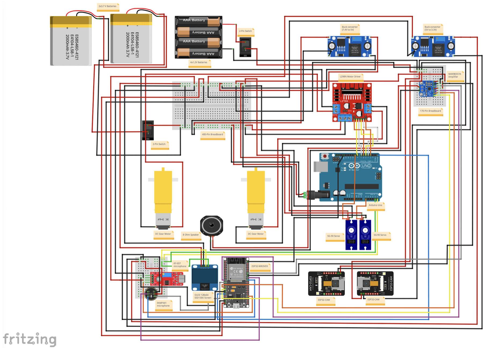

The Arduino robot's connection diagram, showing both power and communication between all devices, can be seen in detail in Figure 1, with the only difference being our 7.4V battery in place of the diagram's two 3.7V batteries in series.

    
    
Figure 1. Arduino robot connection diagram - developed in Fritzing

