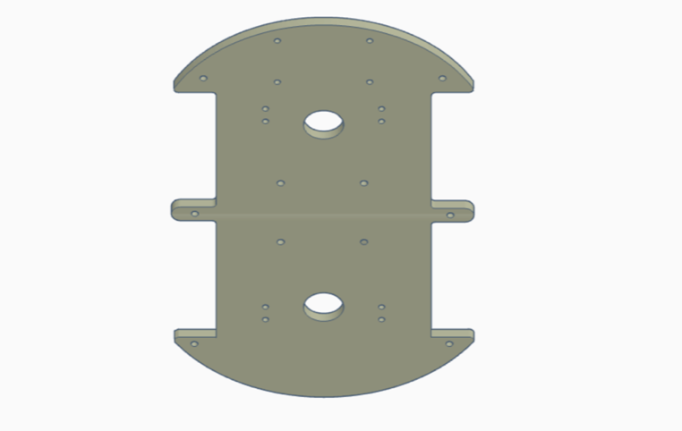
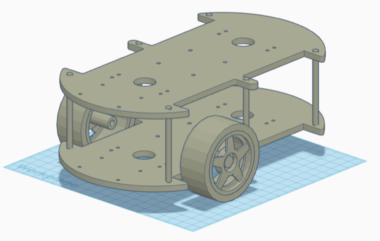
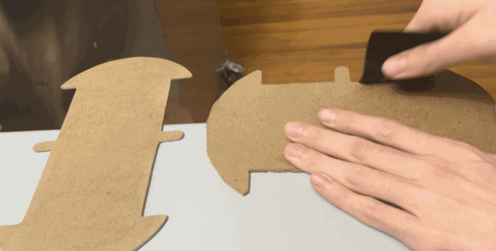
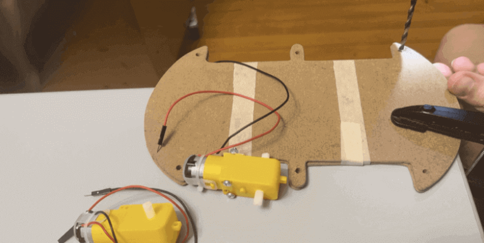
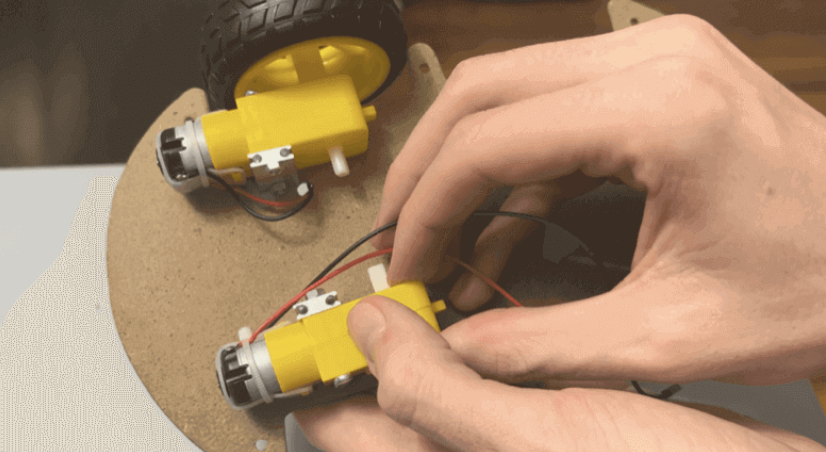
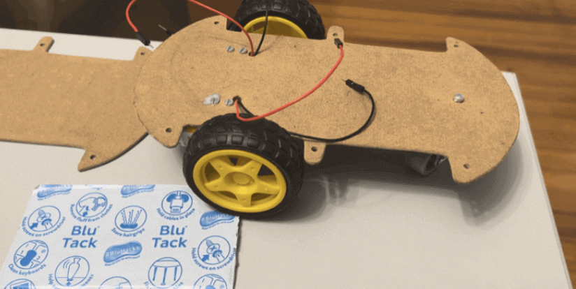
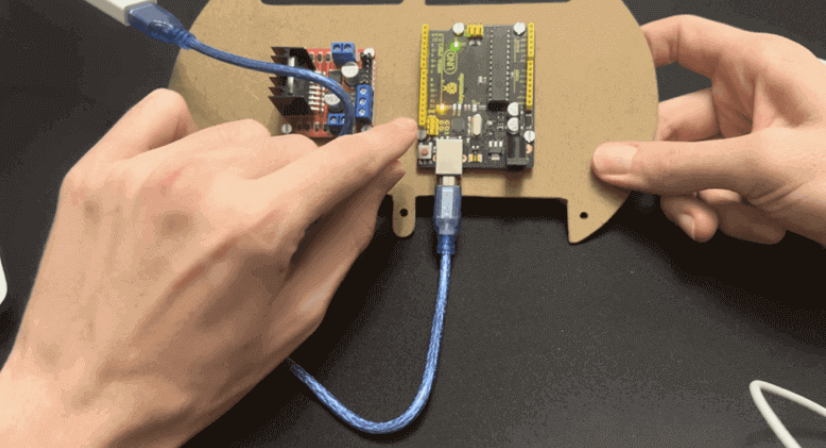
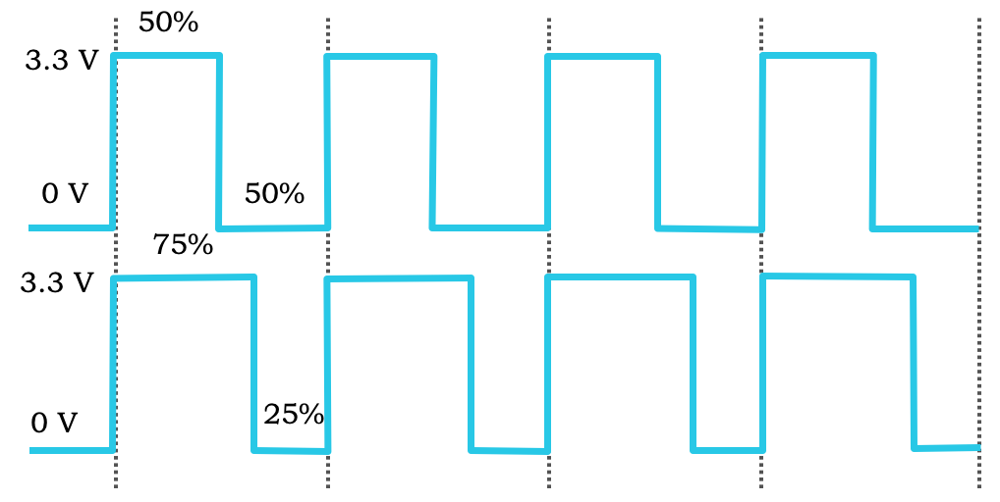
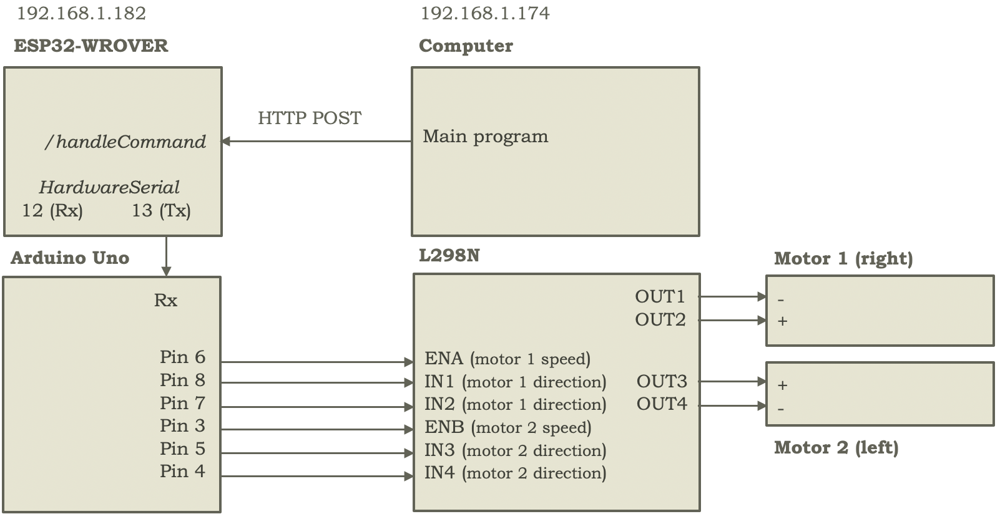

To create the robot, the first step is gathering the hardware components (Arduino Uno, L298N, INMP441, SG-90, MAX89357A, KY-037, breadboards, batteries, etc.), and planning their distribution on a potential chassis, considering aspects such as easy access to batteries for charging and ports for code flashing on the Arduino Uno, ESP32-CAMs, and ESP32-WROVER, to determine the number of levels - and size per level - needed for the robot chassis.

In this case, two levels (or floors) were chosen, using a wooden or particleboard of ~24x13x0.3cm for each level, and following a robot car template - see Figure 2 - to draw the chassis shape to be cut (for example, to leave space for the 2 wheels to be connected to the motors, and with 6 protrusions for joining the levels using 6 hexagonal spacers). Snapshots of the sanding process - after cutting - drilling, and motor mounting can be seen in Figure 3, Figure 4, and Figure 5, respectively.

    
    
    
Figure 2. Template used for cutting each chassis level, from ELEGOO Smart Robot Car Kit V4.0, on the left, and view of 2 chassis levels joined by hexagonal spacers, noting the wheel positions - where the 2 DC motors would be fitted, which are screwed to the lower chassis - in the spaces specifically left for them, on the right.

    
    
Figure 3. Robot chassis sanding, after cutting phase.

    
    
Figure 4. Drilling both chassis floors for joining them with hexagonal spacers.

    
    
Figure 5. Motor installation on the bottom of the first chassis level.

The chassis, therefore, has two complete levels, with components attached to the bottom of the first level (i.e., closest to the ground), to the top of the first level, and to the top of the second level. Later, a third level was created - not shown in the previous figure - partially, and only in the robot's rear section (similar to a spoiler), due to space constraints after expanding the initial robot design to include audio and speech capabilities. Thus, increasing the chassis size is recommended if a third level is to be avoided.

Similarly, it's important to note that the motors are attached to the bottom of the first floor in this case so they remain level with the caster wheel installed under the first floor. However, depending on the caster wheel size, it may be necessary to install the motors on the top of the first floor - similar to Figure 2 - since the wheels attached to the motors are typically significantly larger than the caster wheel, and it's important to keep the lower chassis level.

A snapshot of this first phase's result can be seen in Figure 6.

    
    
Figure 6. First chassis level with two wheels connected to motors and a third caster wheel.

Regarding the motor pack, note that either they come with pre-soldered positive and negative cables (as in this case), or soldering would be required. Also, for chassis mounting, acquiring 2 motor mounts (metal pieces in Figure 5) is recommended, to screw 2 horizontal screws - securing motor to mount - and 2 vertical ones - securing mount to chassis - if not included in the pack (as they were in this case).

After this first phase, the Arduino Uno is tested by connecting it to the computer - via a USB A to USB B cable - and uploading a test program (like Blink.ino). If functional, it is screwed to the top of the second chassis level - using the M3 holes that come standard with the Arduino - as shown in Figure 7.

    
    
Figure 7. Mounting of Arduino Uno - and in the figure, L298N - to the top of the second chassis level using M3 screws, with Arduino connected to computer for Blink.ino execution.

After testing the Arduino (currently powered from the computer), a rechargeable battery and a breadboard are installed on the top of the lower chassis level, in this case using Blue Tack for adhesion, allowing easy disassembly if needed. It's important to emphasize here that the battery charging connector (micro-USB in this case) and the breadboard pins should be easily accessible, to facilitate battery charging and connection of other components to the breadboard's power columns (+ and -).

Then, both chassis levels are joined with hexagonal spacers and headed M3 screws. Once both chassis parts are joined, the motors' + (positive) and - (negative) cables are connected to the L298N (also screwed to the chassis), specifically to OUT1 and OUT2 (for right motor) and OUT3 and OUT4 (for left motor, from the robot's perspective). Subsequently, the 7.4V battery's + and - cables are connected to one of the breadboard's + and - column pairs (battery positive to breadboard positive, and respectively for the negative pole), to power the Arduino and L298N (but not the motors directly, as they are powered through the L298N controller). For the L298N, the +12V input is used (not 5V) for the positive pole (and GND for negative), and the DC barrel jack for the Arduino, since using the 5V or 3.3V input would damage our component. Also, note that unless specified otherwise, all connections use Dupont cables.

At this point, motor functionality can be tested by connecting Arduino pins 8 and 7 (which will send movement commands to the motor controller) to L298N's IN1 and IN2 (to control rotation direction - forward by sending 10, backward by sending 01, or stop by sending 00 - of the right wheel) and similarly pins 5 and 4 to IN3 and IN4 to control the robot's left wheel.

Additionally, by connecting Arduino Uno's pins 6 and 3 (Pulse Width Modulation, or PWM) to L298N's ENA and ENB, values from 0 to 255 can be written to Arduino pins 6 and 3 to be interpreted by ENA and ENB as the speed at which the controller should command the right and left motors to move, respectively.

More precisely, writing 0 to 255 translates internally into a certain pulse duration. Thus, information is sent not only through voltage change but through the duration of the sent pulse (which modifies the average voltage read at reception), a concept that can be observed in more detail in Figure 8.

    
    
Figure 8. Graphical representation of 2 pulse width modulation scenarios, with 50% of the period (equivalent to writing 128, for example in ENB for left motor) at high level (3.3V), top, and 75% (192), bottom, for motor speeds of 50 and 75% of maximum possible speed, respectively.

Finally, using a voltage reducer (taking 7.4V input from the breadboard's 7.4V + and - columns and providing 5V output to the other + and - column pair of the same 400-pin breadboard), the ESP32-WROVER is powered by connecting its 5V pin to the + column (at 5V) and its GND pin to the breadboard's - column. Then, by similarly connecting the WROVER's pin 13 (Tx, with HardwareSerial) to Arduino's Rx, and flashing the WROVER with a sketch that requests an IP address and creates an endpoint at /handleCommand (see for example, http://192.168.1.182:80/handleCommand), the communication circuit is completed. This allows the computer - where the LLM will run in the future - to send an HTTP POST to /handleCommand with wheel movement direction and speed parameters at any time, as long as it's connected to the same network as the ESP32-WROVER. These parameters are processed in the WROVER and sent via HardwareSerial through pin 13 and received at Rx by the Arduino (which is flashed with a receiving sketch). The Arduino then writes the motor rotation direction and speed to pins 8, 7, 5, 4, 6, and 3, received by the L298N at IN1, IN2, IN3, IN4, ENA, and ENB, which in turn sends the necessary pulses to the motors' + and - poles, connected to OUT1, OUT2 (right motor), OUT3, and OUT4 (left motor), respectively, as presented in Figure 9, to effectively control rotation speed and direction from the computer.

    
    
Figure 9. Communication summary between computer, ESP32-WROVER, Arduino Uno, L298N, and motors, for their control through commands sent from the computer (where the language model runs and whose commands are parsed to send the corresponding movement order, if any, to the robot).

