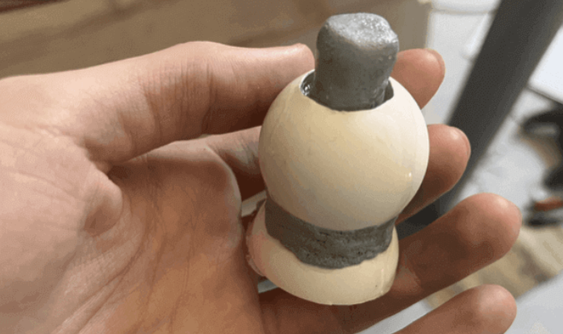
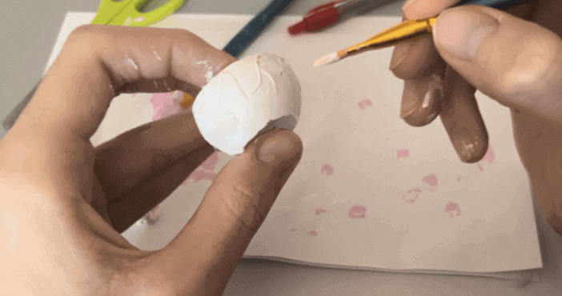
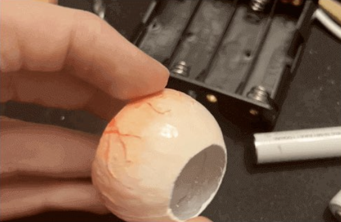
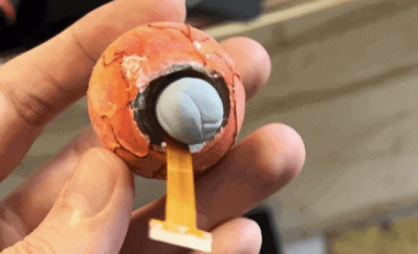
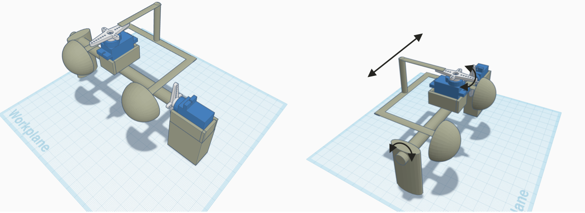
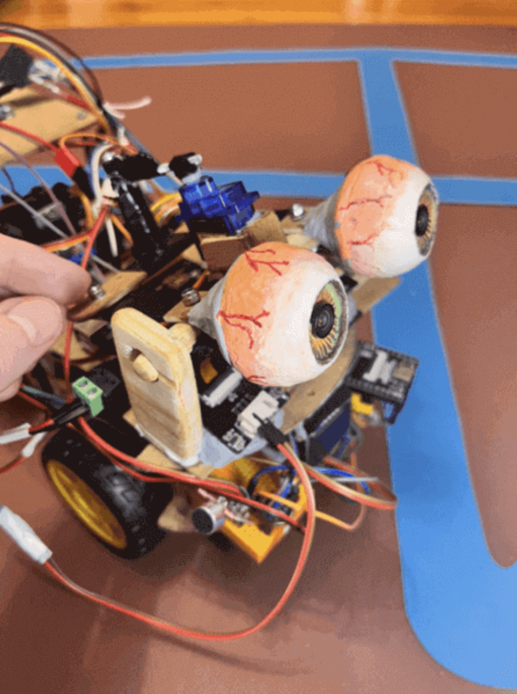
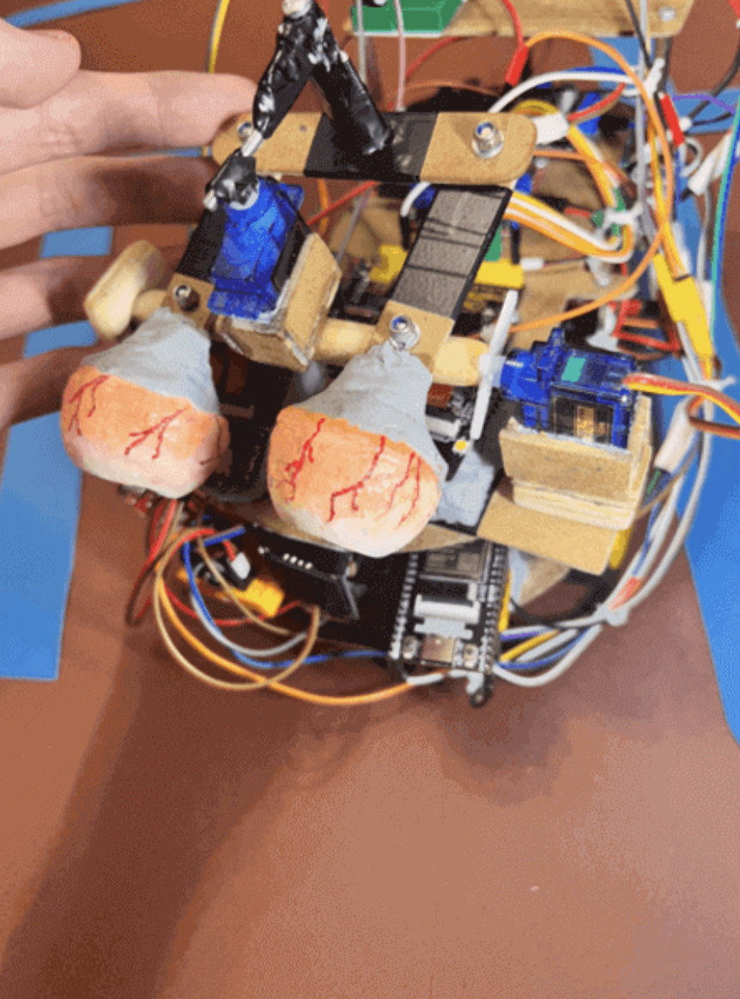
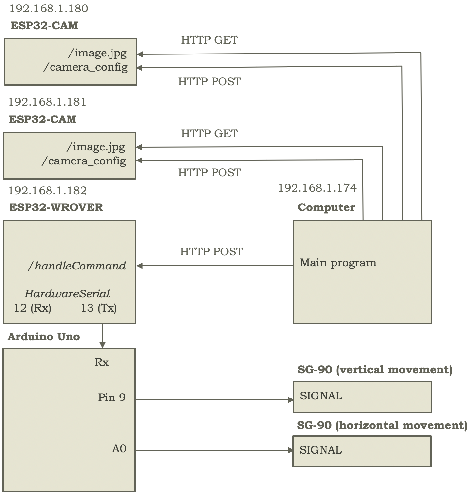

To make the eyes, a ping pong ball is first used as a mold to pour Epoxy resin (with 12-24h drying time) over it, using Blue Tack (which doesn't adhere to Epoxy resin) to create a space (when the Blue Tack is removed) through which to insert the OV2640 through the eye, serving as a pupil and allowing for the capture of images after its connection to the ESP32-CAM.

In this case, a piece of a second ping pong ball is used, gluing it (to prevent resin from leaking from the main mold) inversely to the main ball, to create a concave area (in the final eye) on which to place the iris (versus placing or painting it flat on the surface), although this step is optional. Figure 10 shows one of these molds, already filled with Epoxy resin, and with Blue Tack - see gray putty - in the center, to form a hole through which to insert the camera.

Note also that, depending on how high you choose to fill the main ping pong ball with resin (and given that the filling part, the upper part in the figure, represents the back of the eye), it can become more spherical, or closer to a semi-sphere (if you decide that the back of the eye should be flat rather than rounded), as desired.

    
    
Figure 10. Eye mold filled with Epoxy resin - poured from its top - and with Blue Tack in its center to create a space for, after removal, placing the OV2640. Part of second ball can also be seen placed inversely (to the main ball) at the bottom of the mold, to generate a concave area on which to place the iris.

Once the resin is dry, and mold and Blue Tack removed, it's recommended to use white paint to cover it, similarly adhering a variety of veins - created with thread, in this case, and bonded with the paint itself, to try to improve the eye's appearance (see Figure 11). In this case, a gradient is also created, from red (in back) to white (in front), and once the paint is dry, the veins are highlighted with different shades of red. Finally, note how, in this case, the eye is almost a hemisphere, while in the previous figure's mold (belonging to another attempt), the eye is (almost) a sphere.

    
    
Figure 11. Eye painting and vein adhesion process.

After completing the painting process, a thin layer of Epoxy resin is applied to give the eye a glossy appearance and, afterward, the OV2640 is inserted (importantly, in the same position in both eyes so that frames from one camera aren't rotated relative to the other), and the remaining space is filled with Blue Tack, finally placing a printed iris - in this case, created with DALL·E - on the front part. Figure 12 shows two eye design iterations (spherical and hemispherical, and with varying vein detail). Ultimately, the first manufactured eyes are used (left in Figure 12), preferring a hemispherical design to facilitate movement, only highlighting the veins on them somewhat more. However, generally, the more iterations created, the better the result tends to be.

    
    
    
Figure 12. First eye iteration, with side view (left), and second, with rear view (and therefore more pronounced veins) and OV2640 and Blue Tack inside it (right).

Also, note that the hole created for the iris could be filled with Epoxy resin to create a complete version of the (hemi)sphere. However, cameras can't see through resin, so in that case, drilling through it might be the best alternative. In such a scenario, painting the iris instead of printing it might also be a better option (to avoid moistening the paper with resin) and, in no case, is it recommended to work with resin with the OV2640 installed. However, none of these possible work lines are implemented for this robot's eyes, noting them only as a comment, similarly recommending, for better design and some more materials (like a 3D printer), [Will Cogley's animatronic eyes tutorial](https://www.youtube.com/watch?v=RqZRKUbA_p0).

With the eyes manufactured, and for their movement, an additional platform is created (screwed to the upper face of the second level) - see Figure 13 - on which two wooden 'pillars' are glued (with Super Glue-3) at their ends (right and left) which aim to hold a wooden cylinder (in this case, cut and sanded from the remaining piece of the same wooden block, ~11x4x0.8cm) gluing the cylinder to the SG-90's servo horn, and thus providing the ability to be pushed by the servo (after setting a rotation angle) to generate the up and down movement of the eyes.

    
    
Figure 13. Views of eye mechanism design, with lateral servo rotation causing cylinder rotation for vertical eye displacement, and central servo rotation causing rectilinear displacement of the rear strip and therefore horizontal eye displacement.

On the other hand, and for right-to-left movement, another SG-90 servo is fixed on the central part of the wooden cylinder, to which a servo horn is attached that in turn connects to a wooden strip that can transmit the rotational movement to two other wooden strips (one per eye and attached with Blue Tack to it) through a third strip perpendicular to them. This mechanism, which uses 4 screws (2 to fix the wooden eye strips to the wooden cylinder, and another 2 to join them to the perpendicular rear strip) and 4 self-locking nuts, can be seen in more detail in Figure 14.

    
    
    
Figure 14. Robot eye movement mechanism.

After creating the movement mechanism, the next step is to connect the pins of the 2 OV2640s - inserted through the eye - to their corresponding ESP32-CAM (in this case, M5Stack Wide for the right eye and Ai-Thinker for the left), placed on the upper level of the second chassis level (below the eyes themselves) with Blue Tack.

After this, both ESP32-CAMs are powered - through the 5V and GND pins - from the battery holder (so that motor and servo use doesn't generate a voltage drop that could restart the cameras, although both power sources could be unified with a sufficiently powerful battery), and similarly the SG-90s are powered, in this case to the breadboard's 5V + and - lines with their positive and negative cables.

With ESP32-CAMs and SG-90s powered, and finally, updated versions of the sketches are flashed to the ESP32-CAMs, ESP32-WROVER, and Arduino, noting the following tips for ESP32-CAM operation:

- First, the correct pin layout must be established in the code, according to the available ESP32-CAM model - for example, D0=32 in M5Stack Wide but D0=5 in Ai-Thinker.

- Additionally, you can play with the internal clock frequency, from 8MHz to 20MHz, where higher frequencies are faster but create darker frames.

- On the other hand, it's recommended to use several networks that the cameras can connect to (for example, home router WiFi and mobile hotspot) to avoid having to re-flash code to the ESP32-CAMs if you're in an environment where the primary network isn't available.

- Similarly, it's recommended to use [AsyncTCP](https://github.com/me-no-dev/AsyncTCP), [ESPAsyncWebServer](https://github.com/me-no-dev/ESPAsyncWebServer), and [esp32-camera](https://github.com/espressif/esp32-camera) to create an asynchronous web server (instead of a synchronous one) in the ESP32-CAMs, which allows significantly increasing the number of frames per second.

- Also, it's suggested to play with the ESP32-CAMs' position, to try to avoid interference or signal loss.

- And finally, it's recommended to create the /camera_config endpoint on each camera to allow modifying the served image size and quality without having to flash a new sketch each time you want to change their values in the ESP32-CAMs.

This way, and adding the main endpoint, /image.jpg (in this case, accessible at http://192.168.1.180:80/image.jpg for the right eye and http://192.168.1.181:80/image.jpg for the left eye), it allows, on demand from the computer, obtaining the image captured by the ESP32-CAM through HTTP GET request, and reusing the previous WROVER endpoint (/handleCommand), and once the image (or pair of images, making an HTTP GET request to each ESP32-CAM) is obtained, and after processing them by the language model, the order of a new eye position to the robot, sending it to the WROVER through HTTP POST request, which in turn receives it, processes it, and sends it through pin 13 (Tx with HardwareSerial) to the Arduino which similarly processes it and sends it through pins 9 and A0 (connected to SIGNAL of each SG-90) to the servos responsible for vertical and horizontal eye movement, as can be seen in more detail in Figure 15.

    
    
Figure 15. Communication summary between computer, ESP32-WROVER, Arduino Uno, ESP32-CAMs, and SG-90s, for obtaining images from ESP32-CAMs and controlling the robot's eyes through commands sent from the computer (where the language model runs and whose commands are parsed to send the corresponding movement order, if any, to the robot).

