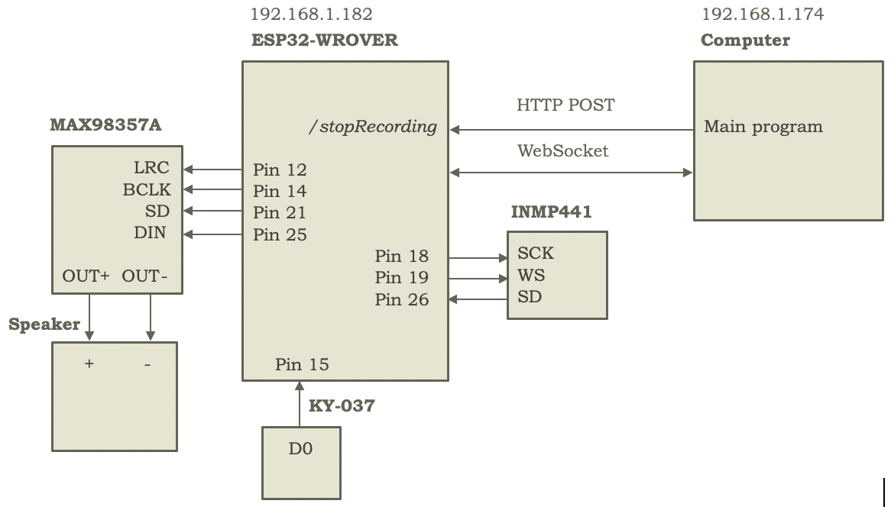

Finally, for audio capture and playback, 2 170-pin breadboards are used, the first on the first level, at the front, and the second on the rear spoiler, at the back, to place a KY-037 (sound detector) and INMP441 (microphone) for audio capture at the front, and a MAX98357A amplifier (connected to an 8Ω and 3W speaker) for output at the back.

This way, when the KY-037 detects a sound above its threshold, which is configured by potentiometer, it sends a signal through its D0 pin, which, connected to the WROVER's pin 15, allows it to indicate (using a variable, soundDetected, updated in the interrupt handling) that a sound has been detected, and therefore the WROVER starts reading data from the INMP441 microphone, sent through SD (Serial Data), connected to pin 26 (and with SCK (Serial Clock) and WS (Word Select), connected to pins 18 and 19, respectively), to be sent through a WebSocket (with host on the main computer and port 8888) to the computer so it can transcribe it with Speech-to-Text, pass the text to the language model, and convert its response text to audio using Text-to-Speech, to, through the same WebSocket, send the audio to the WROVER which in turn sends it to the amplifier (through pin 25, connected to DIN (Digital Input), with LRC (Left/Right Clock), BLCK (Bit Clock) and SD (ShutDown) connected to pins 12, 14 and 21, respectively) which finally sends it to the speaker for playback.

It should be noted that both KY-037 - on front 170-pin breadboard - and MAX98357A - on rear 170-pin breadboard - are powered from the 5V + and - column pair of the 400-pin breadboard, while the INMP441 (also on the front 170-pin breadboard) is powered at 3.3V from the output of a second buck converter that takes 5V input - from the 400-pin breadboard - and outputs it at 3.3V, necessary to avoid damaging the microphone, which doesn't support 5V power.

Similarly, it's worth noting that, to avoid noise issues, the amplifier's SD (ShutDown) pin is controlled, setting it to low level when all audio to be played from the computer has been received ("stop": true), and to high level when new audio begins to be received, managed in the WebSocket's onMessageCallback.

Additionally, for proper audio input management, the communication flow includes the use of an endpoint in the WROVER, /stopRecording, which allows the computer to send an HTTP POST request indicating the end of word reception - not necessarily sound - when the latest Speech-to-Text transcriptions result in the same text (in the robot, when the last 3 transcriptions are the same, requesting a transcription every second), managed with another boolean variable, stopRecording, in the WROVER - after receiving the HTTP POST request - to stop sending audio through the WebSocket.

Schematically, the communication summary between the different components for audio management can be seen in Figure 16.

    
    
Figure 16. Communication summary between computer, ESP32-WROVER, KY-037, INMP441, MAX98357A, and speaker for sound detection, sending it to the computer (where it's converted to text using Speech-to-Text, to serve as input to the language model and whose speech response part is converted to audio with Text-to-Speech), receiving stop signal, and sending audio back, to be played by the robot's speaker.

Finally, it's worth noting that for Speech-to-Text and Text-to-Speech processes, whisper-tiny (with HuggingFace Transformers) and your_tts (with coqui-ai/TTS, cloning a CC0-licensed voice - No Copyright - from [FreeSound](https://freesound.org/)) are used, respectively, after testing four model variants for Speech-to-Text (whisper-tiny, whisper-small, whisper-medium, and whisper-large-v2) and 4 variants for Text-to-Speech (xtts_v2, your_tts, tortoise-v2, and speedy-speech).

Tables 1 and 2 show a brief summary of experiments on the following audios/texts (randomly taken from the internet), in versions with low and high volume and short and longer duration for the different Speech-to-Text and Text-to-Speech models considered for the robot.

---

(Audio in short version and low volume for Speech-to-Text) One, two, three, four, five, one, two, three, four, five.

---

(Audio in long version and high volume for Speech-to-Text) By default, OBS Studio is set to capture your system default desktop audio device and microphone. You can verify this by looking at the volume meters in the mixer section of the main OBS Studio window, and see if they are active. If they aren't moving, or you suspect the wrong device is being captured, click on Settings -> Audio and select the devices manually.

---

(Text in short version for Text-to-Speech) Yes, I am alive.

---

(Text in long version for Text-to-Speech) Please use our dedicated channels for questions and discussion. Help is much more valuable if it's shared publicly so that more people can benefit from it.

---

| Model            | Audio Version        | Time (seconds) | Correct Conversion |
| ---------------- | -------------------- | -------------- | ------------------ |
| whisper-tiny     | Short and low volume | 0.45           | Yes                |
| whisper-tiny     | Long and high volume | 0.66           | Yes                |
| whisper-small    | Short and low volume | 1.13           | Yes                |
| whisper-small    | Long and high volume | 2.39           | Yes                |
| whisper-medium   | Short and low volume | 2.83           | Yes                |
| whisper-medium   | Long and high volume | 6.19           | Yes                |
| whisper-large-v2 | Short and low volume | 6.01           | Yes                |
| whisper-large-v2 | Long and high volume | 11.27          | Yes                |

Table 1. Summary of experiment results on 4 Whisper models for Speech-to-Text under 2 types of audio - short and low volume and long and high volume.

| Model         | Text Version | Time (seconds) | Real-time Factor (seconds) | Correct Conversion | Notes                                                             |
| ------------- | ------------ | -------------- | -------------------------- | ------------------ | ----------------------------------------------------------------- |
| xtts_v2       | Short        | 4.99           | 1.41                       | Yes                | Good quality, correct cadence, human sound                        |
| xtts_v2       | Long         | 20.51          | 1.61                       | Yes                | Good quality, correct cadence, human sound                        |
| your_tts      | Short        | 0.63           | 0.41                       | Yes                | Slow cadence, robotic-like sound                                  |
| your_tts      | Long         | 0.97           | 0.14                       | Yes                | Slow cadence, robotic-like sound                                  |
| tortoise-v2   | Short        | 81.68          | 26.15                      | Yes                | No voice cloning, human sound but voice changes between sentences |
| tortoise-v2   | Long         | 367.44         | 31.52                      | Yes                | No voice cloning, human sound but voice changes between sentences |
| speedy-speech | Short        | 0.13           | 0.08                       | Yes                | Sound with Asian accent and slight robotic touch                  |
| speedy-speech | Long         | 0.64           | 0.06                       | Yes                | Sound with Asian accent and slight robotic touch                  |

Table 2. Summary of experiment results on 4 coqui-ai/TTS models for Text-to-Speech under 2 types of text - short and long.
