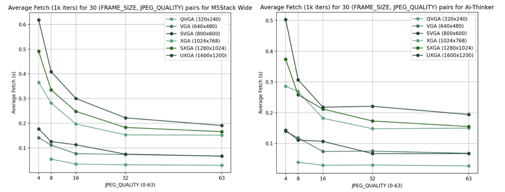

Since different tasks (such as face recognition, depth estimation, etc.) may require different models and libraries (Tensorflow, YOLOv8, Mediapipe, or OpenCV, among others), and these may require different computation times and image qualities to function correctly, it's important to find a balance between the requirements of the models used and those of the task to be performed by the robot (for example, an indoor driving task, where the environment changes rapidly due to robot movement, will probably require a higher frame rate than a face recognition task when conversing with an interlocutor - for instance, to refer to them by name - which generally won't vary very quickly, and where therefore the frame rate can be lower, while from the models' perspective, they may need higher image quality for face recognition, but accept lower quality to identify the path for the robot to follow).

Therefore, it's necessary to find a size and quality - which ultimately affect the cameras' frame rate - that can offer the best compromise for the robot according to the task it faces, and for this, it's decided to include, as briefly mentioned earlier, an endpoint, /camera_config, in the ESP32-CAMs, to allow programmatically changing size and quality when necessary. Note that other parameters, such as clock speed or number of buffers, could also be configured in the same way, but after several tests, it's considered sufficient to work with fixed values of 1 buffer and 20MHz clock frequency.

Therefore, and to acquire a better idea of this quality-size compromise in the ESP32-CAMs, the following study is carried out, requesting (synchronously) a total of 1,000 frames for each of the following 30 quality-size combinations (where 4 is higher quality and QVGA smaller size) and calculating their average fetch time, obtaining results between 0.027 and 0.618(s) per image - that is, from ~1.7 to 37 fps - according to quality and size. The complete result of the experiment can be seen in Table 3 for the M5Stack Wide model and in Table 4 for Ai-Thinker, and graphically in Figure 17, observing the frame rate evolution as requested image size and quality increase.

| JPEG Quality (0-63) → |     4     |     8     |    16     |    32     |    63     |
| --------------------- | :-------: | :-------: | :-------: | :-------: | :-------: |
| **Frame size ↓**      |           |           |           |           |           |
| **QVGA** (320x240)    |    Err    | 0.045 (s) | 0.035 (s) | 0.032 (s) | 0.030 (s) |
| **VGA** (640x480)     | 0.141 (s) | 0.112 (s) | 0.077 (s) | 0.074 (s) | 0.067 (s) |
| **SVGA** (800x600)    | 0.177 (s) | 0.126 (s) | 0.113 (s) | 0.075 (s) | 0.067 (s) |
| **XGA** (1024x768)    | 0.365 (s) | 0.282 (s) | 0.197 (s) | 0.153 (s) | 0.152 (s) |
| **SXGA** (1280x1024)  | 0.491 (s) | 0.335 (s) | 0.248 (s) | 0.183 (s) | 0.166 (s) |
| **UXGA** (1600x1200)  | 0.618 (s) | 0.409 (s) | 0.300 (s) | 0.222 (s) | 0.191 (s) |

Table 3. Average fetch time after 1000 synchronous iterations (i.e., images) in 30 different M5Stack Wide model ESP32-CAM configurations, in seconds.

| JPEG Quality (0-63) → |     4     |     8     |    16     |    32     |    63     |
| --------------------- | :-------: | :-------: | :-------: | :-------: | :-------: |
| **Frame size ↓**      |           |           |           |           |           |
| **QVGA** (320x240)    |    Err    | 0.039 (s) | 0.029 (s) | 0.030 (s) | 0.027 (s) |
| **VGA** (640x480)     | 0.139 (s) | 0.118 (s) | 0.074 (s) | 0.075 (s) | 0.068 (s) |
| **SVGA** (800x600)    | 0.143 (s) | 0.111 (s) | 0.107 (s) | 0.067 (s) | 0.067 (s) |
| **XGA** (1024x768)    | 0.286 (s) | 0.269 (s) | 0.182 (s) | 0.148 (s) | 0.150 (s) |
| **SXGA** (1280x1024)  | 0.374 (s) | 0.258 (s) | 0.212 (s) | 0.173 (s) | 0.155 (s) |
| **UXGA** (1600x1200)  | 0.503 (s) | 0.307 (s) | 0.218 (s) | 0.221 (s) | 0.194 (s) |

Table 4. Average fetch time after 1000 synchronous iterations (i.e., images) in 30 different Ai-Thinker model ESP32-CAM configurations, in seconds.

    
    
Figure 17. Average fetch time for 1000 iterations with 30 ESP32-CAM configurations of M5Stack Wide model, on the left, and Ai-Thinker, on the right, in seconds.

