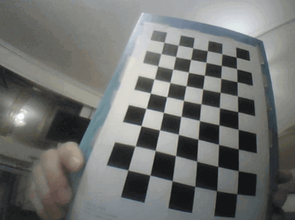
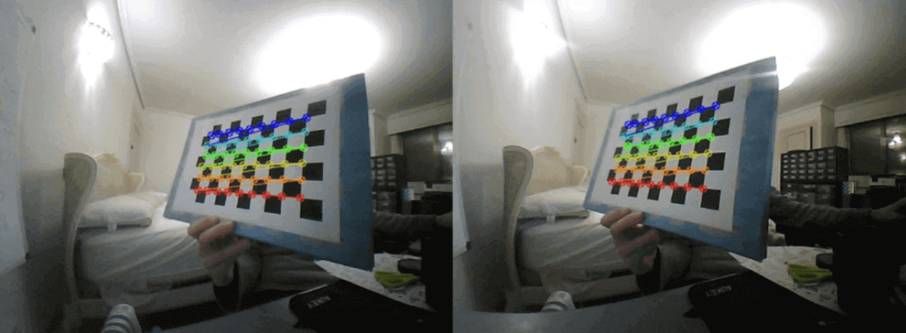
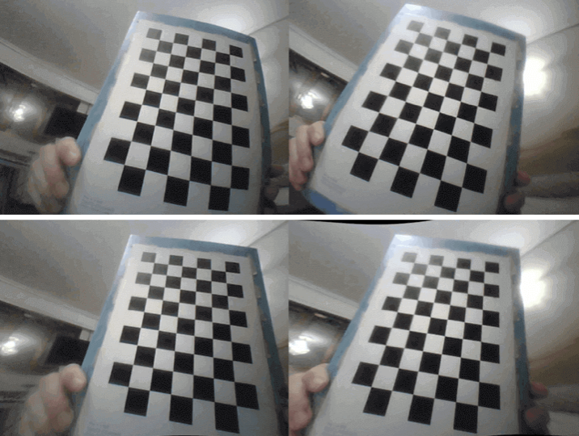

Finally, since eye movement must be allowed (remembering that the OV2640s are precisely their pupil, and their cable must pass through the eye to connect to their ESP32-CAM), their variant with 75mm cable length and 160º field of view must be used (versus, for example, 21mm cable and 66º field of view). Thus, the 75mm cable allows the necessary maneuvering range for eye movement, although, in exchange, the lens in 75mm cable models is fisheye, which notably distorts the images. Figure 18 shows an example of this distortion with a frame from one of the cameras.

    
    
Figure 18. Robot camera capture where the fisheye lens distortion (curvature) is notably visible.

Therefore, it is decided to calibrate both cameras to eliminate - as much as possible - this distortion, under the premise that correcting this distortion can be beneficial for face recognition or depth estimation processes.

In this case, OpenCV's most common 'chessboard' pattern is printed, with 10x7 squares (9x6 inner corners to detect), and several frame pairs are captured (from both cameras simultaneously - with a small error margin), resulting in a total of 14 pairs for calibration, after discarding any pair where the detection of all corners and lines connecting them, with cv2.findChessboardCorners and cv2.cornerSubPix, is not 'perfect' - see example of discarded pair in Figure 19 - to avoid negatively affecting the extrinsic calibration (that is, between cameras, for stereo vision).

    
    
Figure 19. Pair of images (left eye, right eye) with incorrect corner detection in the right frame and which must therefore be discarded.

Thus, and after intrinsic calibration (per camera) with cv2.fisheye.calibrate and extrinsic calibration (between cameras) with cv2.fisheye.stereoCalibrate, an error of ~0.29, ~0.28, and ~0.31 is obtained for left camera intrinsic, right camera intrinsic, and extrinsic calibrations, respectively, very reasonable values for good calibration, although better physical alignment of the OV2640s (inserted inside the eyes and difficult to handle) could have improved them.

Finally, and after storing matrix, distortion coefficients, rotation vectors, and translation vectors (from intrinsic calibration) and rotation matrix, translation vector, essential matrix, and fundamental matrix (from extrinsic calibration), the parameters are tested with both calibration and new images, with cv2.fisheye.stereoRectify, cv2.initUndistortRectifyMap, and cv2.remap, using the process to store the generated stereo maps for faster processing in the future, and with the results visible in Figure 20.

    
    
Figure 20. Pair of images (left eye, right eye) in the upper part, and same pair of frames after distortion correction and rectification processes in the lower part.

